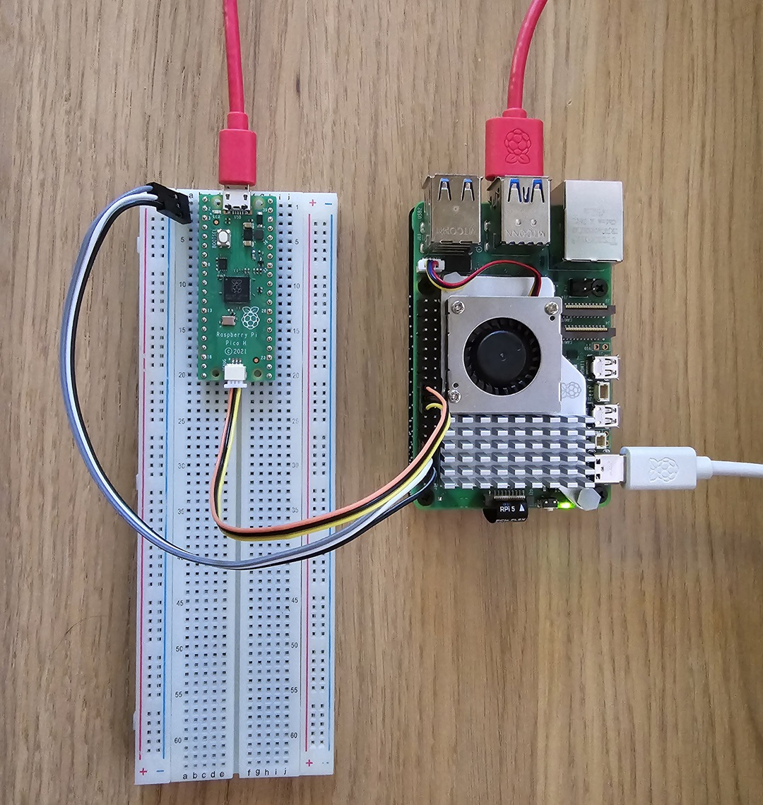

You don't need to buy a Rapsberry Pi Debug Probe if you already have a Raspberry Pi!

## Steps
WIP

## Photo

## Usage
Similar to [Raspberry Pi Debug Probe](https://www.raspberrypi.com/documentation/microcontrollers/debug-probe.html) but use a different interface `openocd -f interface/linuxgpiod-raspberrypi.cfg -f target/rp2040.cfg -c "program blink verify reset exit"`.

## Reference
[Raspberry Pi Forum Discussion](https://forums.raspberrypi.com/viewtopic.php?t=362826)